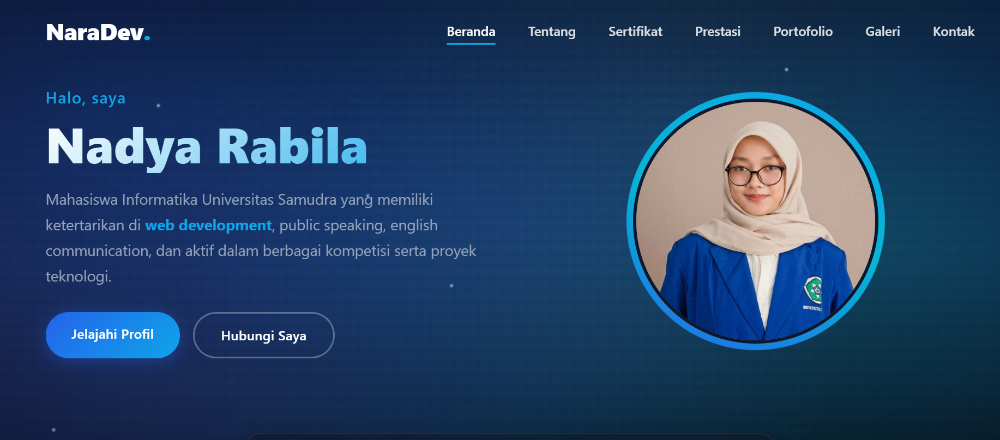

# Website Portfolio Personal

Website ini merupakan portfolio pribadi yang saya buat menggunakan PHP Native dan MySQL. Website ini berfungsi untuk menampilkan data diri, pengalaman, sertifikat, prestasi, serta hasil karya saya secara dinamis melalui dashboard admin.

---

## Versi Website

Website ini memiliki dua versi:

-  **Website Dinamis (Project Saat Ini)**  
  Dibangun menggunakan PHP Native + MySQL dengan sistem dashboard admin.

-  **Website Statis (Versi Awal)**  
  https://naradev.netlify.app  
  Website ini merupakan versi awal dengan tampilan yang sama, sebelum dikembangkan menjadi website dinamis.

---

## Fitur Utama

- Sistem Login Admin (menggunakan session)
- Dashboard Admin untuk pengelolaan data
- CRUD Portfolio (tambah, edit, hapus proyek)
- CRUD Sertifikat / Pelatihan
- CRUD Prestasi
- CRUD Galeri
- Pengaturan Profil secara dinamis
- Pengaturan Kontak secara dinamis
- Sistem Komentar Pengunjung (tanpa login)
- Mini Music Player
- Upload gambar dan audio
- Tampilan responsive (desktop & mobile)

---

##  Teknologi yang Digunakan

- PHP Native
- MySQL / MariaDB
- HTML5, CSS3, JavaScript (Vanilla)
- PDO (Database Connection)
- Font Awesome
- XAMPP (Local Server)

---

##  Cara Menjalankan Project

1. Clone repository ini
2. Import database ke phpMyAdmin
3. Sesuaikan konfigurasi database pada file koneksi
4. Jalankan menggunakan XAMPP (folder htdocs)
5. Akses melalui browser: `http://localhost/nama-folder`

---

##  Notes

Project ini dikembangkan sebagai website portfolio pribadi untuk tugas pemrograman web. Saya melakukan transisi dari website statis menjadi website dinamis dengan sistem CRUD dan dashboard admin.

---

##  Author

Nadya Rabila
